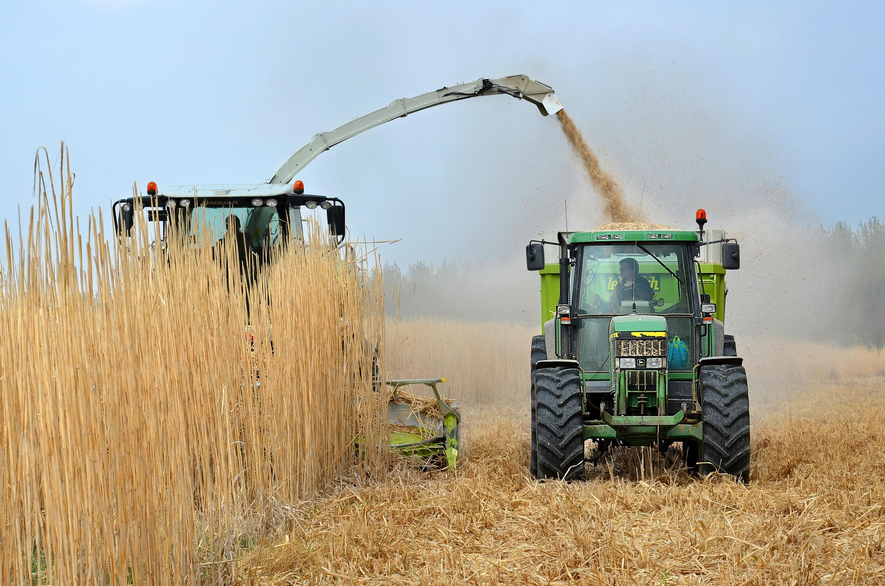
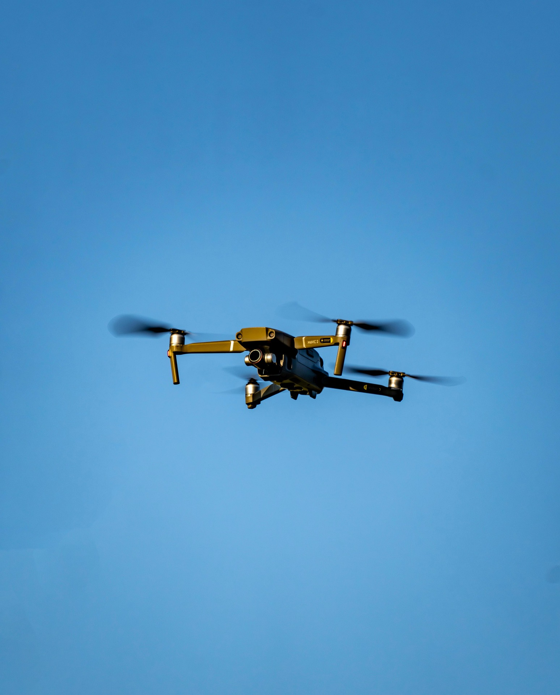
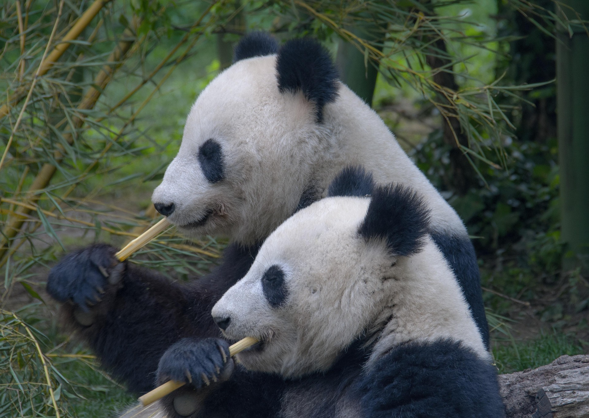

<!DOCTYPE html>
<html lang="en">

<head>
    <meta charset="UTF-8">
    <meta name="viewport" content="width=device-width, initial-scale=1.0">

    <title>Yan AKOUEDENOUDJE | Robotics & Smart Agriculture</title>

    <link rel="stylesheet" href="style.css">
</head>

<body>

<header>
    <nav>
        <h2 class="logo">YA</h2>

        <ul>
            <li><a href="#about">About</a></li>
            <li><a href="#projects">Projects</a></li>
            <li><a href="#skills">Skills</a></li>
            <li><a href="#contact">Contact</a></li>
        </ul>
    </nav>
</header>

<section class="hero">

    

        
Hello, I'm

        <h1>
            Yan AKOUEDENOUDJE
        </h1>

        <h2>
            Future Mechatronics & Robotics Engineer
        </h2>

        

        
            🚜 Smart Agriculture
            🤖 Robotics
            🐍 Python
            ⚡ Embedded Systems
        
        

        

            Building intelligent technologies
            for Smart Agriculture.
        

        

            <a href="#projects">
                Explore Projects
            </a>

            <a href="assets/files/CV_Yan_AKOUEDENOUDJE.pdf">
                Download CV
            </a>

        

    

    

        

    

</section>

<!-- ==========================
     ABOUT SECTION
========================== -->

<section id="about" class="about">

    

        

    

    

        

            About Me
        

        <h2>
            Engineering Agriculture
            Through Technology
        </h2>

        

            I am Yan AKOUEDENOUDJE, an Agro-Equipment
            Technician passionate about robotics,
            embedded systems and smart agriculture.
        

        

            My background combines agricultural engineering,
            electrotechnics, mechanical design,
            electronics and programming.
        

        

            I enjoy designing intelligent systems that
            connect software and hardware to solve
            real-world agricultural challenges.
        

        

            

                <h3>🚜 Agriculture</h3>

                

                    Agricultural machinery,
                    precision agriculture
                    and equipment innovation.
                

            

            

                <h3>🤖 Robotics</h3>

                

                    Embedded systems,
                    automation and intelligent machines.
                

            

            

                <h3>💻 Programming</h3>

                

                    Python, C/C++,
                    data analysis and automation.
                

            

        

    

</section>

<!-- ==========================
     PROJECTS SECTION
========================== -->

<section id="projects" class="projects">

    

        

            My Projects
        

        <h2>
            Engineering Solutions
            I Have Built
        </h2>

        

            A selection of projects combining
            agriculture, electronics,
            programming and mechanical engineering.
        

    

    

        <!-- PROJECT 1 -->

        

            

            

                <h3>
                    Electronic Dual-Fuel System
                </h3>

                

                    Design and implementation of an
                    Arduino-based control system for
                    a diesel engine using Diesel and
                    Jatropha vegetable oil.
                

                

                    Arduino
                    C/C++
                    Electronics

                

                <a href="#">
                    View Project →
                </a>

            

        

        <!-- PROJECT 2 -->

        

            

            

                <h3>
                    Python Projects
                </h3>

                

                    Programming projects focused on
                    algorithms, automation,
                    data analysis and problem solving.
                

                

                    Python
                    Pandas
                    NumPy

                

                <a href="#">
                    View Project →
                </a>

            

        

        <!-- PROJECT 3 -->

        

            

            

                <h3>
                    Robotics & Embedded Systems
                </h3>

                

                    Arduino projects involving
                    sensors, actuators and
                    automation systems.
                

                

                    Arduino
                    Sensors
                    IoT

                

                <a href="#">
                    View Project →
                </a>

            

        

    

</section>

<!-- ==========================
     SKILLS SECTION
========================== -->

<section id="skills" class="skills">

    

        

            Skills & Technologies
        

        <h2>
            Tools I Use To Build Solutions
        </h2>

        

            Combining software, electronics,
            mechanical design and agricultural engineering.
        

    

    

        <!-- SOFTWARE -->

        

            

                💻
            

            <h3>
                Software Development
            </h3>

            <ul>

                <li>Python</li>
                <li>C / C++</li>
                <li>Git & GitHub</li>
                <li>Data Analysis</li>
                <li>Automation</li>

            </ul>

        

        <!-- ROBOTICS -->

        

            

                🤖
            

            <h3>
                Embedded Systems
            </h3>

            <ul>

                <li>Arduino</li>
                <li>Sensors</li>
                <li>Actuators</li>
                <li>IoT</li>
                <li>Electronics</li>

            </ul>

        

        <!-- MECHANICAL -->

        

            

                ⚙️
            

            <h3>
                Mechanical Engineering
            </h3>

            <ul>

                <li>SolidWorks</li>
                <li>CAD Design</li>
                <li>Mechanical Design</li>
                <li>Manufacturing</li>
                <li>Welding</li>

            </ul>

        

        <!-- AGRICULTURE -->

        

            

                🌱
            

            <h3>
                Smart Agriculture
            </h3>

            <ul>

                <li>Agricultural Machinery</li>
                <li>Precision Agriculture</li>
                <li>Agro-equipment</li>
                <li>Farm Technologies</li>
                <li>Sustainable Solutions</li>

            </ul>

        

    

</section>

<!-- ==========================
     TIMELINE SECTION
========================== -->

<section id="journey" class="timeline-section">

    

        

            My Journey
        

        <h2>
            Education & Professional Experience
        </h2>

        

            A journey combining electrical engineering,
            agricultural technologies and robotics.
        

    

    

        <!-- BAC -->

        

            

            

                
                    2020 - 2021
                

                <h3>
                    Baccalauréat F3 - Electrotechnics
                </h3>

                <h4>
                    Technical Education
                </h4>

                

                    Technical training focused on
                    electrical systems, automation basics,
                    electrical installations and industrial
                    technologies.
                

                

                    Electrotechnics
                    Electrical Systems
                    Automation

                

            

        

    

</section>

</body>

</html>
