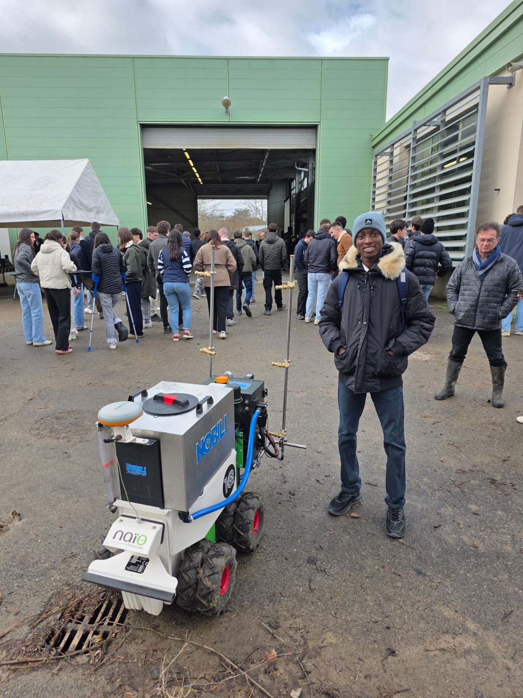
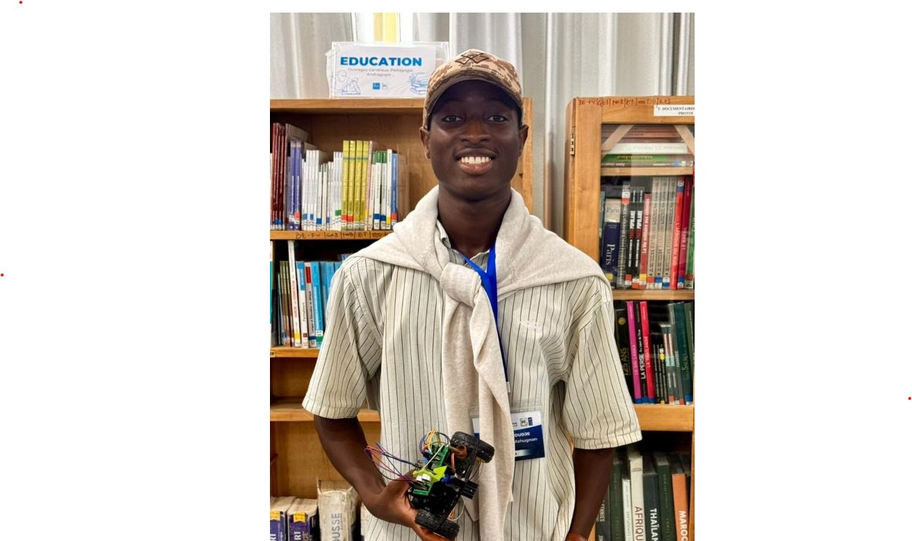

<!DOCTYPE html>
<html lang="en">

<head>
    <meta charset="UTF-8">
    <meta name="viewport" content="width=device-width, initial-scale=1.0">

    <title>Yan AKOUEDENOUDJE | Robotics & Smart Agriculture</title>

    <link rel="stylesheet" href="style.css">
</head>

<body>

<header>
    <nav>
        <h2 class="logo">YA</h2>

        <ul>
            <li><a href="#about">About</a></li>
            <li><a href="#projects">Projects</a></li>
            <li><a href="#skills">Skills</a></li>
            <li><a href="#contact">Contact</a></li>
        </ul>
    </nav>
</header>

<section class="hero">

    

        
Hello, I'm

        <h1>
            Yan AKOUEDENOUDJE
        </h1>

        <h2>
            Future Mechatronics & Robotics Engineer
        </h2>

        

        
            🚜 Smart Agriculture
            🤖 Robotics
            🐍 Python
            ⚡ Embedded Systems
        
        

        

            Building intelligent technologies
            for Smart Agriculture.
        

        

            <a href="#projects">
                Explore Projects
            </a>

            <a href="assets/files/CV_Yan_AKOUEDENOUDJE.pdf">
                Download CV
            </a>

        

    

    

        

    

</section>

<!-- ==========================
     ABOUT SECTION
========================== -->

<section id="about" class="about">

    

        

    

    

        

            About Me
        

        <h2>
            Engineering Agriculture
            Through Technology
        </h2>

        

            I am Yan AKOUEDENOUDJE, an Agro-Equipment
            Technician passionate about robotics,
            embedded systems and smart agriculture.
        

        

            My background combines agricultural engineering,
            electrotechnics, mechanical design,
            electronics and programming.
        

        

            I enjoy designing intelligent systems that
            connect software and hardware to solve
            real-world agricultural challenges.
        

        

            

                <h3>🚜 Agriculture</h3>

                

                    Agricultural machinery,
                    precision agriculture
                    and equipment innovation.
                

            

            

                <h3>🤖 Robotics</h3>

                

                    Embedded systems,
                    automation and intelligent machines.
                

            

            

                <h3>💻 Programming</h3>

                

                    Python, C/C++,
                    data analysis and automation.
                

            

        

    

</section>

</body>

</html>
